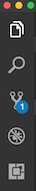

# Auth Shelf Group Project

Our client, Prime Digital Academy: Room 2, has asked for an app to simulate the behavior of their shelf. That is, a list of items placed on the classroom shelf. More details about each of the features are listed below in the README.md.

## Base Mode

We recommend working in groups of 4 or 6 and pair programming for this project. Each pair should take on one of the following features. You will want to identify any tasks that need to be finished in a particular order as a group to avoid merge conflicts.

### Display all Items

The Shelf page (`ShelfPage.js`at `/shelf`) should show all of the items stored in the database in a list or table. **This list should only be viewable to logged in (authenticated) users.**

### Add Items to the Shelf

The Shelf page (`ShelfPage.js` at `/shelf`) should allow a user to add a new item to the database (which should immediately appear in the list). **This view should only be viewable to logged in (authenticated) users.**

> NOTE: Image url should be a full path to an existing image on the web. You should not attempt to implement image upload for this.

### Delete Items from the Shelf

An authenticated user should be able to delete items from the shelf if they were the one who added the item to the shelf.

> NOTE: This should require client and server changes. An unauthenticated attacker from Postman should not be able to delete anything.

## Stretch Goals

- Ability to edit an existing item on the shelf from the info page.
- Have anyone, not just logged in users, be able to see what is on the shelf, but not edit, remove, nor add.
- Add a new route to display all items for a specific user called "My Shelf". The client-side url should be `/shelf/2` where `/2` should be the id of the logged in user. Only the items associated with the specific logged in user should be displayed on this new page.
- Use [multer](https://github.com/expressjs/multer) for image upload on the add page.
- Style the application with Material-UI.

---


## Prerequisites

Before you get started, make sure you have the following software installed on your computer:

- [Node.js](https://nodejs.org/en/)
- [PostrgeSQL](https://www.postgresql.org/)
- [Nodemon](https://nodemon.io/)

## Create Database and Table

Create a new database called `auth_shelf` and create a `user` table:
 user-update

```SQL
CREATE TABLE "user" (
    "id" SERIAL PRIMARY KEY,
    "username" VARCHAR (80) UNIQUE NOT NULL,
    "password" VARCHAR (1000) NOT NULL
);

CREATE TABLE "item" (
    "id" SERIAL PRIMARY KEY,
    "description" VARCHAR (80) NOT NULL,
    "image_url" VARCHAR (2083),
    "user_id" INT REFERENCES "user"
);
```

## Development Setup Instructions

- Run `npm install`
- Create a `.env` file at the root of the project and paste this line into the file:
  ```
  SERVER_SESSION_SECRET=superDuperSecret
  ```
  While you're in your new `.env` file, take the time to replace `superDuperSecret` with some long random string like `25POUbVtx6RKVNWszd9ERB9Bb6` to keep your application secure. Here's a site that can help you: [https://passwordsgenerator.net/](https://passwordsgenerator.net/). If you don't do this step, create a secret with less than eight characters, or leave it as `superDuperSecret`, you will get a warning.
- Start postgres if not running already by using `brew services start postgresql`
- Run `npm run server`
- Run `npm run client`
- Navigate to `localhost:3000`

## Debugging

To debug, you will need to run the client-side separately from the server. Start the client by running the command `npm run client`. Start the debugging server by selecting the Debug button.



Then make sure `Launch Program` is selected from the dropdown, then click the green play arrow.


## Testing Routes with Postman

To use Postman with this repo, you will need to set up requests in Postman to register a user and login a user at a minimum.

Keep in mind that once you using the login route, Postman will manage your session cookie for you just like a browser, ensuring it is sent with each subsequent request. If you delete the `localhost` cookie in Postman, it will effectively log you out.

1. Start the server - `npm run server`
2. [Import the sample routes JSON file](./PostmanPrimeSoloRoutes.json) by clicking `Import` in Postman. Select the file.
3. Click `Collections` and `Send` the following three calls in order:
   1. `POST /api/user/register` registers a new user, see body to change username/password
   2. `POST /api/user/login` will login a user, see body to change username/password
   3. `GET /api/user` will get user information, by default it's not very much

After running the login route above, you can try any other route you've created that requires a logged in user!

## Production Build

Before pushing to Heroku, run `npm run build` in terminal. This will create a build folder that contains the code Heroku will be pointed at. You can test this build by typing `npm start`. Keep in mind that `npm start` will let you preview the production build but will **not** auto update.

- Start postgres if not running already by using `brew services start postgresql`
- Run `npm start`
- Navigate to `localhost:5000`

## Lay of the Land

There are a few videos linked below that show a walkthrough the client and sever setup to help acclimatize to the boilerplate. Please take some time to watch the videos in order to get a better understanding of what the boilerplate is like.

- [Initial Set](https://vimeo.com/453297271)
- [Server Walkthrough](https://vimeo.com/453297212)
- [Client Walkthrough](https://vimeo.com/453297124)

Directory Structure:

- `src/` contains the React application
- `public/` contains static assets for the client-side
- `build/` after you build the project, contains the transpiled code from `src/` and `public/` that will be viewed on the production site
- `server/` contains the Express App

This code is also heavily commented. We recommend reading through the comments, getting a lay of the land, and becoming comfortable with how the code works before you start making too many changes. If you're wondering where to start, consider reading through component file comments in the following order:

- src/components
  - App/App
  - Footer/Footer
  - Nav/Nav
  - AboutPage/AboutPage
  - InfoPage/InfoPage
  - UserPage/UserPage
  - LoginPage/LoginPage
  - RegisterPage/RegisterPage
  - LogOutButton/LogOutButton
  - ProtectedRoute/ProtectedRoute

## Deployment

1. Create a new Heroku project
1. Link the Heroku project to the project GitHub Repo
1. Create an Heroku Postgres database
1. Connect to the Heroku Postgres database from Postico
1. Create the necessary tables
1. Add an environment variable for `SERVER_SESSION_SECRET` with a nice random string for security
1. In the deploy section, select manual deploy

## Update Documentation

Customize this ReadMe and the code comments in this project to read less like a starter repo and more like a project. Here is an example: https://gist.github.com/PurpleBooth/109311bb0361f32d87a2
